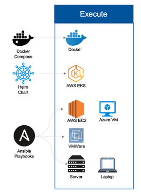

# Ansible manage with Docker

> Изучение Ansible и практика прямо в Docker.

<p align="center">

  

</p>


Данный модуль предназначен для изучения и отработки практических навыков Ansible.

В качестве инфраструктуры используются контейнеры Docker запускаемые с помощью Docker-compose.<br>
При необходимости можно подключить другие сервера, например созданные на AWS (сервис EC2).

### Важно
> Установка и настройка *Docker/Docker-compose*, подключение по *ssh*, работа в терминале
> выходит за рамки данного руководста.
> Читайте официальную документацию (ссылки внизу).


## Usage

### Запустить *playbook* одним из следующих способов:
- Подключиться к контейнеру с установленным Ansible:
```bash
docker-compose exec ans_master bash
```
Запустить команду:
```bash
ansible-playbook playbook_ping_all.yml
```
- Сразу запустить нужный *playbook*:
```bash
docker-compose exec ans_master ansible-playbook playbook_ping_all.yml
```

Результат команды:
```
PLAY [Test Connection] ******************************************************************************

TASK [Gathering Facts] ******************************************************************************
ok: [client1]
ok: [client2]
fatal: [web_srv]: UNREACHABLE! => {"changed": false, "msg": "Failed to connect to the host via ssh: ssh: connect to host 18.188.95.218 port 22: Connection timed out", "unreachable": true}
fatal: [web_srv2]: UNREACHABLE! => {"changed": false, "msg": "Failed to connect to the host via ssh: ssh: connect to host 3.135.247.219 port 22: Connection timed out", "unreachable": true}
fatal: [web_srv3]: UNREACHABLE! => {"changed": false, "msg": "Failed to connect to the host via ssh: ssh: connect to host 52.14.223.228 port 22: Connection timed out", "unreachable": true}

TASK [Ping servers] *********************************************************************************
ok: [client1]
ok: [client2]

PLAY RECAP ******************************************************************************************
client1                    : ok=2    changed=0    unreachable=0    failed=0    skipped=0    rescued=0    ignored=0   
client2                    : ok=2    changed=0    unreachable=0    failed=0    skipped=0    rescued=0    ignored=0   
web_srv                    : ok=0    changed=0    unreachable=1    failed=0    skipped=0    rescued=0    ignored=0   
web_srv2                   : ok=0    changed=0    unreachable=1    failed=0    skipped=0    rescued=0    ignored=0   
web_srv3                   : ok=0    changed=0    unreachable=1    failed=0    skipped=0    rescued=0    ignored=0   
```

### Завершить работу:
```bash
docker-compose down
```


## API

### Настройка переменных для групп серверов в каталоге config/ansible/group_vars:
По умолчанию имеет файл *office*, который содержит имя пользователя используемое при подключении к серверам:
>  ansible_ssh_user: root

### Настройка Ansible осуществляется в файле конфигурации config/ansible/ansible.cfg:
> [defaults]
> host_key_checking = false                            
При необходимости можно добавить другие настройки ([см. документацию](https://docs.ansible.com/ansible/latest/cli/ansible-config.html))

### Доступные *playbooks* в каталоге config/ansible:
Playbook | Описание
-------- | --------
playbook_ping_all.yml | Проверка доступности всех серверов из файла *hosts*
playbook_install_and_start_apache.yml | Установка и запуск web-сервера Apache, копирование index.html страницы для проверки работы
playbook_error_handling.yml | Пример обработки ошибок, игнорирование
playbook_delegate.yml | Пример с делегированием задачи (tasks) другому серверу
playbook_loop.yml | Пример использования цикла (loop)

> При необходимости можно редактировать на свое усмотрение, добавлять свои *playbook*.

## Install

### 1. Установить *docker* и *docker-compose* для вашей системы согластно  [официальному руководсту](https://docs.docker.com/engine/install/).

### 2. Клонировать репозиторий:
```bash
git clone https://gitlab.rebrainme.com/devops_users_repos/2808/rebrain-devops-task1.git
```

### 3. Перейти в каталог *rebrain-devops-task1*:
```bash
cd rebrain-devops-task1
```

### 4. Выполнить сборку и запуск *docker-compose*:
```bash
docker-compose -f docker-compose.yml up -d --build
```

Проверить что контейнеры запущены и работают:
```bash
docker ps
```
Результат команды:
```bash
CONTAINER ID   IMAGE                COMMAND                  CREATED          STATUS          PORTS     NAMES
1a9fa284c09b   ansible_client2      "/home/ansible/scrip…"   30 seconds ago   Up 28 seconds             ansible_client2_1
23e76b140071   ansible_client1      "/home/ansible/scrip…"   30 seconds ago   Up 28 seconds             ansible_client1_1
757ca22b20b6   ansible_ans_master   "/home/ansible/scrip…"   30 seconds ago   Up 29 seconds             ansible_ans_master_1
````

### 5. Сгенирировать ssh-ключи для подлкючения к серверам (контейнерам) 
- сгенерированные ключи сохранить в каталог server/.ssh
- публичный ключ сохранить в файл clients/.ssh/autorized_keys
### 6. Отредактировать файл host (inventory файл) config/ansible/hosts
- Добавить новые сервера
- Добавить новые группы
- При необходимости указать переменные для определенного сервера


## Acknowledgments

Ansible manage with Docker was inspired by Team REBRAIN! :+1:

## See Also

- [`Docker/Docker-compose`](https://docs.docker.com/engine/install/)
- [`Ansible`](https://docs.ansible.com/ansible/latest/index.html)
- [`Как пользоваться SSH`](https://losst.ru/kak-polzovatsya-ssh)
- [`Что такое bash / shell`](https://habr.com/ru/post/548078/)

## License

ISC
